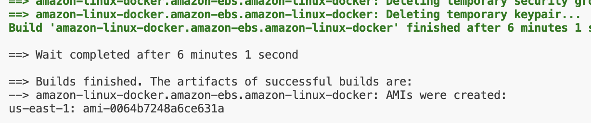
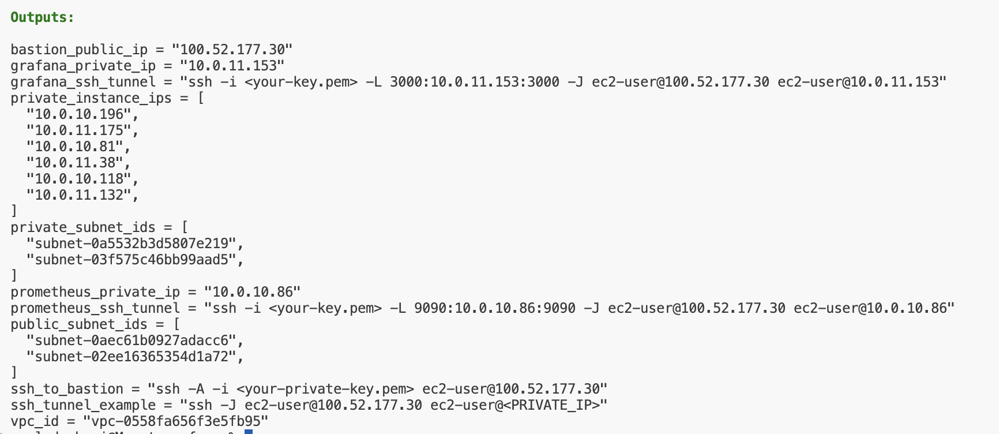
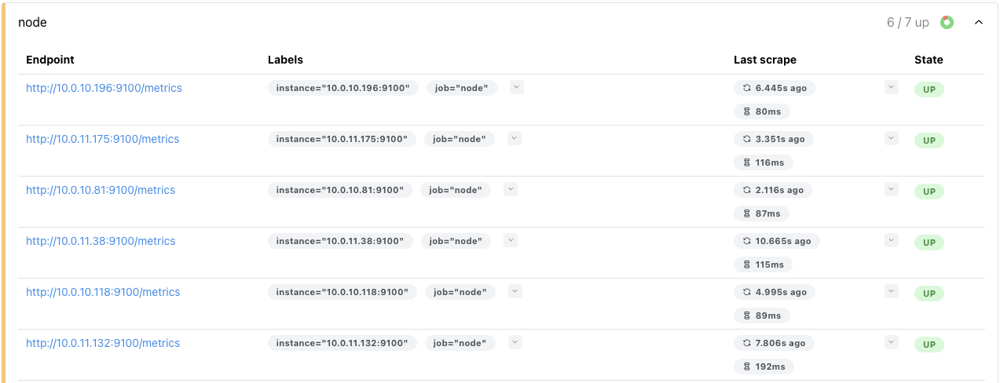
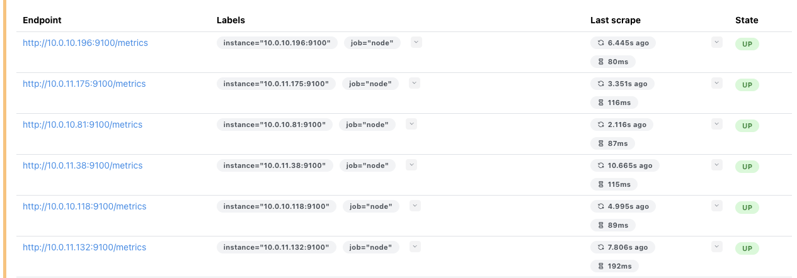
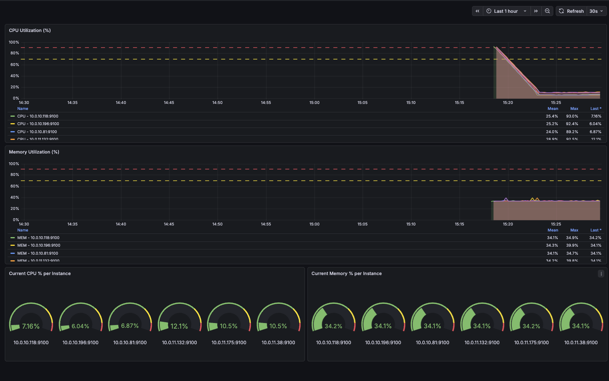

# CS686 Assignment 8 — Prometheus & Grafana Monitoring with Terraform + Packer

This project extends the Assignment 7 infrastructure to add a full observability stack. Prometheus and Grafana are deployed as dedicated EC2 instances in the private subnet. Every EC2 instance in the environment runs **Node Exporter**, baked into the custom AMI at build time, which exposes CPU and memory metrics on port 9100.

---

## Architecture

```
Internet
    │
    ▼
Internet Gateway
    │
┌───┴──────────────────────────────────────────────────────────────────┐
│  VPC  10.0.0.0/16                                                    │
│                                                                      │
│  ┌────────────────────────────────┐                                  │
│  │  Public Subnets                │                                  │
│  │  10.0.1.0/24  (us-east-1a)     │                                  │
│  │  10.0.2.0/24  (us-east-1b)     │                                  │
│  │                                │                                  │
│  │  ┌──────────────────────────┐  │                                  │
│  │  │  Bastion Host            │◄─┼── SSH (your IP only, port 22)   │
│  │  └────────────┬─────────────┘  │                                  │
│  └───────────────┼────────────────┘                                  │
│                  │ SSH / SSH tunnels                                  │
│  ┌───────────────▼──────────────────────────────────────────────┐   │
│  │  Private Subnets                                              │   │
│  │  10.0.10.0/24 (us-east-1a)   10.0.11.0/24 (us-east-1b)       │   │
│  │                                                               │   │
│  │  ┌────────────────────────────────────────────────────────┐  │   │
│  │  │  6 × App Server EC2  (Docker + Node Exporter :9100)    │  │   │
│  │  └────────────────────────────┬───────────────────────────┘  │   │
│  │                                │ scrape :9100                  │   │
│  │  ┌─────────────────────────┐  │                               │   │
│  │  │  Prometheus EC2         │◄─┘                               │   │
│  │  │  prom/prometheus :9090  │──── also scrapes localhost:9100  │   │
│  │  └────────────┬────────────┘                                  │   │
│  │               │ PromQL query                                   │   │
│  │  ┌────────────▼────────────┐                                  │   │
│  │  │  Grafana EC2            │                                  │   │
│  │  │  grafana/grafana :3000  │                                  │   │
│  │  │  (dashboard auto-loaded)│                                  │   │
│  │  └─────────────────────────┘                                  │   │
│  └────────────────────────────────────────────────────────────────┘  │
└──────────────────────────────────────────────────────────────────────┘
```

### Resource Summary

| Resource | Count | Details |
|---|---|---|
| VPC | 1 | 10.0.0.0/16, DNS enabled |
| Public subnets | 2 | 10.0.1.0/24, 10.0.2.0/24 |
| Private subnets | 2 | 10.0.10.0/24, 10.0.11.0/24 |
| NAT Gateway | 1 | Allows private instances to pull Docker images |
| Bastion Host | 1 | Public subnet, SSH restricted to your IP only |
| App Server EC2 | 6 | Private subnets, round-robin across AZs |
| **Prometheus EC2** | **1** | **Private subnet — Docker container on :9090** |
| **Grafana EC2** | **1** | **Private subnet — Docker container on :3000** |

---

## Prerequisites

- [Packer](https://developer.hashicorp.com/packer/install) ≥ 1.10
- [Terraform](https://developer.hashicorp.com/terraform/install) ≥ 1.6
- AWS CLI configured (`aws configure`) with IAM permissions for EC2/VPC
- An existing **EC2 Key Pair** in the target region

---

## Step 1 — Build the Custom AMI with Packer

The Packer build bakes three things into the AMI:

1. **Docker** — runs Prometheus/Grafana containers
2. **Node Exporter v1.8.2** — systemd service, auto-starts on boot, exposes host metrics on `:9100`
3. **Your SSH public key** — injected into `ec2-user`'s `authorized_keys`

```bash
cd packer

packer init amazon-linux.pkr.hcl
packer build amazon-linux.pkr.hcl
```

To use a custom SSH public key:
```bash
packer build -var 'ssh_public_key=ssh-rsa AAAA...' amazon-linux.pkr.hcl
```

> **Copy the AMI ID** printed at the end — you need it for Step 2.

**Screenshot — Packer build complete (AMI ID highlighted):**



---

## Step 2 — Configure Terraform Variables

Edit `terraform/terraform.tfvars`:

```hcl
aws_region   = "us-east-1"
project_name = "cs686-a8"

# Your existing EC2 Key Pair name in AWS
key_name = "your-key-pair-name"

# Your public IP — run: curl https://checkip.amazonaws.com/
my_ip_cidr = "YOUR.IP.ADDRESS/32"

# AMI ID from the Packer build above
custom_ami_id = "ami-0xxxxxxxxxxxxxxxxx"
```

---

## Step 3 — Deploy with Terraform

```bash
cd terraform

terraform init
terraform plan
terraform apply
```

Type `yes` at the prompt. After ~5 minutes Terraform prints all outputs including the ready-to-use SSH tunnel commands for Prometheus and Grafana.

**Screenshot — Terraform apply output:**



---

## Step 4 — Connect to Private Instances

### SSH ProxyJump (recommended)

```bash
ssh -i your-key.pem \
  -J ec2-user@<BASTION_PUBLIC_IP> \
  ec2-user@<PRIVATE_INSTANCE_IP>
```

### SSH Agent Forwarding

```bash
ssh-add your-key.pem
ssh -A -i your-key.pem ec2-user@<BASTION_PUBLIC_IP>
# Then from inside the bastion:
ssh ec2-user@<PRIVATE_INSTANCE_IP>
```

---

## Step 5 — Access Prometheus

Copy the `prometheus_ssh_tunnel` value from `terraform output` and run it in a terminal:

```bash
ssh -i your-key.pem \
  -L 9090:<PROMETHEUS_PRIVATE_IP>:9090 \
  -J ec2-user@<BASTION_PUBLIC_IP> \
  ec2-user@<PROMETHEUS_PRIVATE_IP>
```

Open in your browser: **http://localhost:9090**

Navigate to **Status → Targets** to confirm all 6 app servers are being scraped.

### What to expect

- All 6 app server IPs listed as targets with state `UP`
- Scrape interval: 15 seconds
- Prometheus also scrapes its own Node Exporter via `localhost:9100`

**Screenshot — Prometheus Targets (overview):**



**Screenshot — Prometheus Targets (all nodes UP):**



---

## Step 6 — Access Grafana

Open a **new terminal** and run the `grafana_ssh_tunnel` from `terraform output`:

```bash
ssh -i your-key.pem \
  -L 3000:<GRAFANA_PRIVATE_IP>:3000 \
  -J ec2-user@<BASTION_PUBLIC_IP> \
  ec2-user@<GRAFANA_PRIVATE_IP>
```

Open in your browser: **http://localhost:3000**

Login with:
- **Username**: `admin`
- **Password**: `admin`

Navigate to **Dashboards → Infrastructure Metrics - CPU & Memory**.

### Dashboard Panels (Bonus)

| Panel | Type | Description |
|---|---|---|
| CPU Utilization (%) | Time-series | CPU % over time, one line per instance |
| Memory Utilization (%) | Time-series | Memory % over time, one line per instance |
| Current CPU % per Instance | Gauge | Live CPU reading for each node |
| Current Memory % per Instance | Gauge | Live memory reading for each node |

The Prometheus datasource and this dashboard are **provisioned automatically** at container startup — no manual configuration needed.

**Screenshot — Grafana Dashboard (CPU & Memory):**



---

## Verifying Node Exporter on Instances

SSH into any app server and confirm:

```bash
systemctl status node_exporter
# ● node_exporter.service - Prometheus Node Exporter
#    Active: active (running)

curl -s http://localhost:9100/metrics | grep node_cpu_seconds_total | head -5
```

---

## Teardown

```bash
cd terraform
terraform destroy
```

> The custom AMI must be deregistered separately via the AWS Console — Terraform does not manage Packer-built AMIs.

---

## Project Structure

```
.
├── packer/
│   ├── amazon-linux.pkr.hcl          # Packer build — Docker + Node Exporter + SSH key
│   └── scripts/
│       ├── install_docker.sh         # Installs Docker, enables as systemd service
│       └── install_node_exporter.sh  # Installs Node Exporter v1.8.2 as systemd service
│
├── terraform/
│   ├── main.tf                       # Root module — VPC, bastion, app servers
│   ├── monitoring.tf                 # Prometheus + Grafana EC2 instances
│   ├── variables.tf                  # All input variable declarations
│   ├── outputs.tf                    # IPs + SSH tunnel commands for all instances
│   ├── terraform.tfvars              # Your values (key pair, AMI ID, IP)
│   ├── templates/
│   │   └── dashboard.json            # Pre-built Grafana dashboard (CPU + memory)
│   └── modules/
│       ├── vpc/                      # VPC, subnets, IGW, NAT, route tables
│       ├── bastion/                  # Bastion EC2 + restricted security group
│       └── private_instances/        # 6 × app server EC2 + security group
│
├── screenshots/
│   ├── packer_build.png
│   ├── terraform_output.png
│   ├── prometheus_targets_overview.png
│   ├── prometheus_targets.png
│   └── grafana_dashboard.png
│
└── README.md
```
